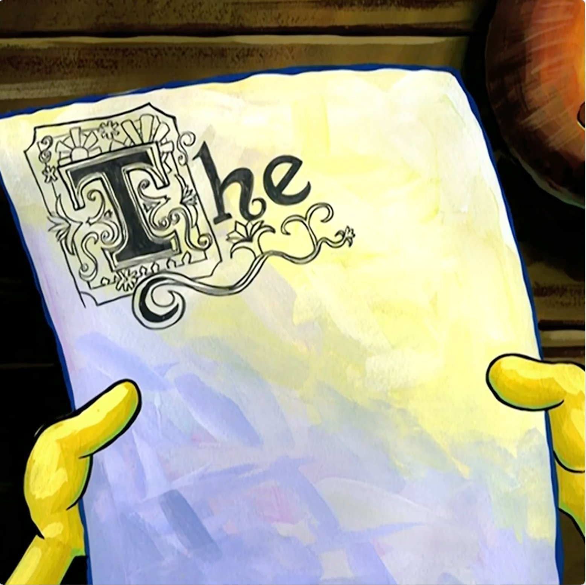

# Folder Structure and Typography

Demonstrating folder creation and creating a description page for QU3NCH!

## Usage

TODO: Write usage instructions

## Contributing

1. Fork it!
2. Create your feature branch: `git checkout -b my-new-feature`
3. Commit your changes: `git commit -am 'Add some feature'`
4. Push to the branch: `git push origin my-new-feature`
5. Submit a pull request :D

## History

01/09/22- Created initial setup (folders, added files, etc.)
01/10/22- Created wireframe, added scaled images, inputted text, styled font
01/11/22- Finished adding in scaled images, did CSS styling, added grid system
01/14/22- Attempted to fix some coding issues, added some extra styling
01/15/22- Corrected the issues, added some extra typography styling, finalized all products

## Credits

Singer, Dan- Author

## License

MIT

  